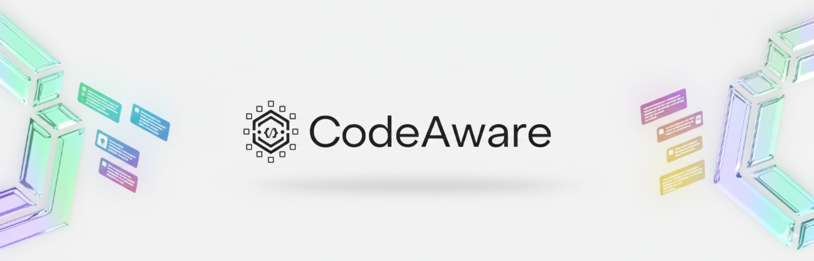

<div align="center">



</div>

<h1 align="center">CodeAware</h1>

<div align="center">

**CodeAware 是一个基于[Continue](https://github.com/continuedev/continue) 的智能代码项目学习辅助工具，帮助开发者通过结构化的项目分解、高亮对应、认知辅助知识卡片来自主理解和编写项目代码**

</div>

<div align="center">

<a target="_blank" href="https://opensource.org/licenses/Apache-2.0" style="background:none">
    
</a>

</div>

## 核心功能

CodeAware 提供四大核心功能，帮助开发者系统化学习和理解代码项目：

### 🎯 1. 项目分解 (Project Decomposition)

将复杂的编程任务智能分解为结构化的学习步骤，提供清晰的认知路径。

#### 功能介绍

- **智能需求理解**：AI 分析用户输入的学习目标或编程任务
- **层级式分解**：生成高级步骤（High-Level Steps）和详细步骤（Detailed Steps）
- **需求映射**：建立高级步骤与详细步骤的对应关系
- **学习目标提取**：自动提取和明确学习目标

#### 交互效果实现

**核心组件：**

- `RequirementEditor.tsx` - 需求编辑器，支持富文本输入
- `RequirementDisplay.tsx` - 需求展示器，可视化显示需求分块
- `RequirementSummary.tsx` - 需求摘要，提供快速概览
- `Step.tsx` - 步骤容器，管理单个步骤的完整生命周期
- `StepTitleBar.tsx` - 步骤标题栏，显示状态和操作按钮
- `StepDescription.tsx` - 步骤描述展示
- `StepEditor.tsx` - 步骤编辑器，支持步骤内容修改

**状态流转：**

```text
需求状态: empty → editing → confirmed → finalized
步骤状态: editing → generated → confirmed → step_dirty → code_dirty
```

#### 数据管理

**相关数据结构** (`codeAwareSlice.ts`)：

```typescript
// 程序需求
ProgramRequirement {
  requirementDescription: string;
  requirementStatus: "empty" | "editing" | "confirmed" | "finalized";
}

// 高级步骤
HighLevelStepItem {
  id: string;
  content: string;
  isCompleted: boolean;
  isHighlighted: boolean;
}

// 详细步骤
StepItem {
  id: string;
  title: string;
  abstract: string;
  stepStatus: "editing" | "generated" | "confirmed" | "step_dirty" | "code_dirty";
  knowledgeCards: KnowledgeCard[];
  knowledgeCardGenerationStatus: KnowledgeCardGenerationStatus;
  originalAbstract?: string;  // 用于恢复编辑
  isHighlighted: boolean;
}

// 步骤映射关系
StepToHighLevelMapping {
  stepId: string;
  highLevelStepId: string;
  highLevelStepIndex: number;
}
```

**相关 Actions：**

- `submitRequirementContent` - 提交需求内容
- `setUserRequirementStatus` - 设置需求状态
- `setHighLevelSteps` - 设置高级步骤
- `setGeneratedSteps` - 设置详细步骤
- `setStepToHighLevelMappings` - 设置步骤映射关系
- `setStepStatus` - 设置步骤状态
- `setStepAbstract` - 更新步骤摘要
- `updateHighLevelStepCompletion` - 更新高级步骤完成状态

#### 智能生成

**核心 Thunk** (`codeAwareGeneration.ts`)：

**`generateStepsFromRequirement`** - 从需求生成步骤

```typescript
输入: { userRequirement: string }
输出: {
  title: string;                        // 会话标题
  learningGoal: string;                 // 学习目标
  highLevelSteps: HighLevelStepItem[];  // 高级步骤列表
  steps: StepItem[];                    // 详细步骤列表
  stepToHighLevelMappings: StepToHighLevelMapping[]; // 映射关系
}
```

---

### 💻 2. 渐进式代码生成 (Progressive Code Generation)

逐步生成代码，每次生成对应一个或多个步骤，支持代码增量更新和智能映射。

#### 功能介绍

- **步骤驱动生成**：根据确认的步骤逐步生成代码
- **代码块管理**：将生成的代码分块，每块对应特定步骤
- **增量更新**：支持在现有代码基础上添加新功能
- **智能重运行**：步骤修改后智能更新对应代码
- **代码编辑模式**：支持手动编辑代码并自动同步映射

#### 交互效果实现

**核心组件：**

- `CodeEditModeToggle.tsx` - 代码编辑模式开关
  - CodeAware 模式：允许 AI 生成和更新代码
  - 手动编辑模式：用户自由编辑，保存快照用于后续同步

**代码编辑工作流：**

1. 用户切换到编辑模式 → 保存当前代码快照
2. 用户手动编辑代码
3. 退出编辑模式 → 触发 `processCodeChanges`
4. 分析代码变更，更新代码块范围和映射关系
5. 标记受影响的步骤为 `code_dirty` 状态

#### 数据管理

**相关数据结构** (`codeAwareSlice.ts`)：

```typescript
// 代码块
CodeChunk {
  id: string;
  content: string;
  range: [number, number];  // [起始行, 结束行]
  filePath: string;
  isHighlighted: boolean;
  disabled: boolean;
}

// 代码编辑模式状态
isCodeEditModeEnabled: boolean;
codeEditModeSnapshot: {
  filePath: string;
  content: string;
  timestamp: number;
} | null;
```

**相关 Actions：**

- `updateCodeChunks` - 添加代码块
- `updateCodeChunkRange` - 更新代码块行范围
- `setCodeChunkDisabled` - 设置代码块禁用状态
- `createOrGetCodeChunk` - 创建或获取代码块（避免重复）
- `toggleCodeEditMode` - 切换编辑模式
- `saveCodeEditModeSnapshot` - 保存代码快照
- `clearCodeEditModeSnapshot` - 清除快照
- `markStepsCodeDirty` - 标记步骤代码已修改
- `updateCodeChunkPositions` - 更新代码块位置
- `clearAllCodeAndMappings` - 清除所有代码和映射

#### 智能生成

**核心 Thunks** (`codeAwareGeneration.ts`)：

**`generateCodeFromSteps`** - 根据步骤生成代码

```typescript
输入: {
  existingCode: string;
  filepath: string;
  orderedSteps: Array<{ id, title, abstract }>;
  previouslyGeneratedSteps?: Array<{ id, title, abstract, current_corresponding_code }>;
}
输出: {
  changedCode: string;  // 完整的更新后代码
  stepsCorrespondingCode: Array<{ id: string; code: string }>;
}
```

**生成流程：**

1. **代码生成阶段**：
   - 构造包含现有代码和步骤信息的提示词
   - LLM 生成完整代码和代码块映射 JSON
   - 验证代码块覆盖率和连续性

2. **代码块处理阶段**：
   - 解析代码块信息（起始行、结束行、语义描述）
   - 提取每个代码块的实际内容
   - 建立代码块到步骤的映射关系

3. **映射创建阶段**：
   - 创建 CodeChunk 对象
   - 创建 CodeAwareMapping 映射关系
   - 更新 Redux 状态

4. **验证和日志**：
   - 验证映射完整性
   - 记录生成详情
   - 同步到 IDE

**`rerunStep`** - 重新运行步骤（步骤修改后更新代码）

```typescript
输入: {
  stepId: string;
  changedStepAbstract: string;
  existingCode: string;
  filepath: string;
}
```

**生成策略：**

- **最小化修改**：仅更新与修改步骤相关的代码
- **保留现有功能**：不破坏其他步骤的代码
- **智能查找**：通过语义描述定位需要修改的代码块

**`processCodeChanges`** - 处理手动代码编辑后的变更

```typescript
输入: {
  currentFilePath: string;
  currentContent: string;
}
```

**处理流程：**

1. 获取快照中的原始代码
2. 计算代码差异（diff）
3. 使用 LLM 分析变更影响的步骤
4. 更新代码块行号范围
5. 标记受影响步骤为 `code_dirty`
6. 清除快照

**辅助函数：**

- `processCodeChunkMappingResponse` - 处理代码块映射响应
- `validateCodeChunkMapping` - 验证映射完整性
- `calculateCodeChunkRange` - 计算代码块行号范围
- `createCodeChunksFromLineArray` - 从行数组创建代码块
- `getStepCorrespondingCode` - 获取步骤对应的所有代码

---

### 🔗 3. 联动高亮 (Link Highlights)

实现需求、步骤、知识卡片、代码块之间的智能高亮联动，帮助理解元素间的对应关系。

#### 功能介绍

- **多元素联动**：点击任一元素，高亮所有相关联的元素
- **IDE 同步高亮**：在 VS Code 编辑器中同步高亮代码块
- **智能查找**：支持通过标识符和元信息模糊匹配
- **批量高亮**：支持同时处理多个高亮事件

#### 交互效果实现

**高亮触发方式：**

1. **鼠标悬停/点击** - 在任意元素上触发
2. **代码选择** - 在 IDE 中选择代码触发
3. **步骤展开** - 展开步骤时自动高亮相关内容

**视觉效果：**

- GUI 中高亮元素背景色变化
- IDE 中代码行背景高亮
- 高亮状态在所有关联元素间同步

#### 数据管理

**相关数据结构** (`codeAwareSlice.ts`)：

```typescript
// 多元素映射关系
CodeAwareMapping {
  codeChunkId?: string;
  highLevelStepId?: string;  // 重命名：从 requirementChunkId 改为 highLevelStepId
  stepId?: string;
  knowledgeCardId?: string;
  isHighlighted: boolean;
  metaInfo?: {
    codeSnippet?: string;      // 代码片段（用于模糊匹配）
    semanticDescription?: string; // 语义描述
  };
}

// 高亮事件
HighlightEvent {
  sourceType: "code" | "requirement" | "step" | "knowledgeCard";
  identifier: string;  // 元素ID
  additionalInfo?: any; // 允许传递任何额外信息（StepItem, KnowledgeCardItem, CodeChunk等）
}

// IDE 通信标志
shouldClearIdeHighlights: boolean;
codeChunksToHighlightInIde: CodeChunk[];
```

**相关 Actions：**

- `updateHighlight` - 核心高亮更新逻辑（支持单个或批量事件）
- `clearAllHighlights` - 清除所有高亮状态
- `updateCodeAwareMappings` - 添加映射关系（自动去重）
- `removeCodeAwareMappings` - 删除指定映射
- `clearKnowledgeCardCodeMappings` - 清除知识卡片代码映射
- `resetIdeCommFlags` - 重置 IDE 通信标志

**高亮逻辑** (`updateHighlight` Reducer)：

1. **接收高亮事件**（单个或数组）
2. **查找匹配映射**：
   - 首先通过 identifier 精确匹配
   - 如果是代码类型且有 additionalInfo，使用元信息模糊匹配
3. **收集关联元素 ID**：
   - 从所有匹配的映射中提取 codeChunkId、highLevelStepId、stepId、knowledgeCardId
   - 使用 Set 去重
4. **清除旧高亮**：调用 `clearAllHighlights`
5. **设置新高亮**：
   - 遍历所有元素集合，设置 `isHighlighted = true`
   - 收集需要在 IDE 中高亮的代码块
6. **触发 IDE 高亮**：设置 `codeChunksToHighlightInIde`

#### 智能生成

映射关系在以下场景自动创建：

1. **步骤生成时** - 创建需求块到步骤的映射
2. **代码生成时** - 创建步骤到代码块的映射
3. **知识卡片生成时** - 创建知识卡片到代码块的映射

**相关 Thunk**：

**`checkAndMapKnowledgeCardsToCode`** - 检查并映射知识卡片到代码

```typescript
输入: { stepId: string }
```

**映射流程：**

1. 获取步骤的所有知识卡片
2. 筛选未禁用且有内容的卡片
3. 查找步骤对应的代码块
4. 使用 LLM 分析知识卡片与代码块的相关性
5. 创建映射关系
6. 记录详细日志

---

### 🎴 4. 知识卡片交互 (Knowledge Cards Interaction)

为每个步骤生成交互式知识卡片，提供概念讲解和自测功能，增强学习体验。

#### 功能介绍

- **自动主题生成**：根据步骤内容生成相关知识点主题
- **详细内容生成**：为每个主题生成结构化的知识讲解
- **测试题生成**：自动生成多选题（MCQ）和简答题（SAQ）
- **智能评分**：使用 LLM 评估简答题答案
- **问答驱动生成**：根据用户提问生成相关知识卡片
- **代码关联**：知识卡片与对应代码块建立映射关系

#### 交互效果实现

**核心组件：**

- `KnowledgeCard.tsx` - 知识卡片容器，管理卡片展示和交互
- `KnowledgeCardContent.tsx` - 知识内容展示（Markdown 渲染）
- `KnowledgeCardMCQ.tsx` - 多选题测试组件
- `KnowledgeCardSAQ.tsx` - 简答题测试组件
- `KnowledgeCardLoader.tsx` - 加载状态组件
- `KnowledgeCardToolBar.tsx` - 卡片工具栏（编辑、删除、重新生成）
- `QuestionPopup.tsx` - 问题弹窗，支持选中代码提问
- `GlobalQuestionModal.tsx` - 全局问题模态框

**交互流程：**

1. **主题生成** → 点击"生成知识卡片"按钮
2. **内容生成** → 点击卡片主题展开详细内容
3. **测试生成** → 内容加载完成后自动生成测试题
4. **答题互动** → 用户选择/输入答案
5. **评分反馈** → 显示正确性和详细解释

**状态指示：**

```text
知识卡片生成状态:
not_generated → generating_themes → themes_generated → 
generating_content → content_generated → generating_tests → completed
```

#### 数据管理

**相关数据结构** (`codeAwareSlice.ts`)：

```typescript
// 知识卡片
KnowledgeCard {
  id: string;
  theme: string;           // 主题
  content: string;         // Markdown 格式的内容
  tests: TestItem[];       // 测试题目数组
  isLoading: boolean;      // 内容加载状态
  testsLoading: boolean;   // 题目加载状态
  disabled: boolean;       // 禁用状态
  isHighlighted: boolean;
}

// 测试题目
TestItem {
  id: string;
  stem: string;            // 题干
  question_type: "multipleChoice" | "shortAnswer";
  standard_answer: string;
  options?: string[];      // 多选题选项
  user_answer?: string;
  is_correct?: boolean;
  remarks?: string;        // 评分备注
  isLoading?: boolean;
}

// 知识卡片生成状态
KnowledgeCardGenerationStatus = 
  | "not_generated"
  | "generating_themes"
  | "themes_generated"
  | "generating_content"
  | "content_generated"
  | "generating_tests"
  | "completed";
```

**相关 Actions：**

- `createKnowledgeCard` - 创建新知识卡片（仅主题）
- `updateKnowledgeCardContent` - 更新卡片内容
- `updateKnowledgeCardTests` - 更新测试题目
- `updateKnowledgeCardTitle` - 更新卡片标题（清空内容）
- `setKnowledgeCardLoading` - 设置内容加载状态
- `setKnowledgeCardTestsLoading` - 设置题目加载状态
- `setKnowledgeCardDisabled` - 设置禁用状态
- `setKnowledgeCardError` - 设置加载错误
- `resetKnowledgeCardContent` - 重置卡片内容
- `setKnowledgeCardGenerationStatus` - 设置生成状态
- `updateSaqTestResult` - 更新简答题评分结果
- `setSaqTestLoading` - 设置简答题评分加载状态

**相关 Selectors：**

- `selectTestByTestId` - 根据测试ID查找测试信息
- `selectTestLoadingState` - 获取测试加载状态

#### 智能生成

**核心 Thunks** (`codeAwareGeneration.ts`)：

**`generateKnowledgeCardThemes`** - 生成知识卡片主题列表

```typescript
输入: {
  stepId: string;
  stepTitle: string;
  stepAbstract: string;
  learningGoal: string;
}
输出: string[]  // 主题列表
```

**生成流程：**

1. 设置生成状态为 `generating_themes`
2. 获取步骤对应的代码
3. 构造提示词（包含步骤信息、代码、学习目标）
4. LLM 生成主题列表 JSON
5. 解析并验证主题
6. 为每个主题创建空的知识卡片
7. 创建卡片到步骤的映射关系
8. 设置状态为 `themes_generated`
9. 记录交互日志

**重试机制**：最多 3 次重试

**`generateKnowledgeCardDetail`** - 生成知识卡片详细内容

```typescript
输入: {
  stepId: string;
  knowledgeCardId: string;
  knowledgeCardTheme: string;
  learningGoal: string;
  codeContext: string;
}
```

**生成流程：**

1. 设置加载状态 `isLoading = true`
2. 构造包含主题、学习目标、代码上下文的提示词
3. LLM 流式生成 Markdown 内容
4. 实时更新卡片内容（流式显示）
5. 内容生成完成后设置 `isLoading = false`
6. 自动触发测试题生成
7. 记录生成日志

**内容要求**：

- 结构化 Markdown 格式
- 包含概念解释、代码示例、应用场景
- 适应学习目标和代码上下文

**`generateKnowledgeCardTests`** - 生成测试题目

```typescript
输入: {
  stepId: string;
  knowledgeCardId: string;
  knowledgeCardTitle: string;
  knowledgeCardContent: string;
  knowledgeCardTheme: string;
  learningGoal: string;
  codeContext: string;
}
```

**生成流程：**

1. 设置题目加载状态 `testsLoading = true`
2. 构造包含卡片内容的提示词
3. LLM 生成测试题目 JSON
4. 解析题目（MCQ 和 SAQ）
5. 为每个题目生成唯一 ID
6. 更新卡片的 tests 数组
7. 设置生成状态为 `completed`
8. 记录生成日志

**题目要求**：

- 3-5 道题目
- 包含多选题和简答题
- 难度适中，覆盖核心知识点

**`generateKnowledgeCardThemesFromQuery`** - 根据用户提问生成知识卡片

```typescript
输入: {
  stepId: string;
  queryContext: {
    selectedCode: string;
    selectedText: string;
    query: string;
  };
  currentStep: { title, abstract };
  existingThemes: string[];
  learningGoal: string;
  task: string;
}
```

**生成策略：**

1. 分析用户问题和选中的代码/文本
2. 识别需要补充的知识点
3. 避免与现有主题重复
4. 生成 1-3 个相关主题
5. 自动创建并生成知识卡片内容

**`processSaqSubmission`** - 处理简答题提交并评分

```typescript
输入: {
  testId: string;
  userAnswer: string;
}
```

**评分流程：**

1. 设置评分加载状态
2. 获取题目信息和标准答案
3. 构造包含题目、标准答案、用户答案的提示词
4. LLM 评估答案正确性
5. 解析评分结果（正确性 + 详细评语）
6. 更新测试结果
7. 记录评分日志

**评分标准**：

- 内容准确性
- 概念理解深度
- 表达清晰度

**`processGlobalQuestion`** - 处理全局提问

```typescript
输入: {
  question: string;
  currentCode: string;
}
输出: {
  selectedStepId: string;
  themes: string[];
  knowledgeCardIds: string[];
}
```

**处理流程：**

1. LLM 分析问题，选择最相关的步骤
2. 生成相关知识卡片主题
3. 自动创建并展开知识卡片
4. 返回选中步骤和生成的卡片信息

---


## 架构设计

### 项目结构

```text
gui/src/
├── pages/codeaware/
│   ├── CodeAware.tsx              # 主界面容器
│   ├── Chat.tsx                   # AI 聊天界面
│   └── components/
│       ├── Requirements/          # 需求管理组件
│       ├── Steps/                 # 步骤管理组件
│       ├── KnowledgeCard/         # 知识卡片组件
│       ├── QuestionPopup/         # 问答组件
│       ├── ToolBar/               # 工具栏组件
│       └── CodeEditModeToggle.tsx
├── redux/
│   ├── slices/
│   │   └── codeAwareSlice.ts      # 核心状态管理
│   └── thunks/
│       └── codeAwareGeneration.ts # 异步生成逻辑
└── App.tsx                         # 路由配置
```

### 路由结构

```typescript
{
  path: ROUTES.HOME,
  element: <CodeAware/>,  // 主界面
},
{
  path: "/chat",
  element: <Chat />,      // AI 聊天界面
}
```

### 状态管理架构

**核心文件：**

- `codeAwareSlice.ts` - Redux 状态管理，定义数据结构、reducers、selectors
- `codeAwareGeneration.ts` - 异步 thunks，处理 LLM 调用和智能生成

**数据流：**

```text
用户交互 → Action → Reducer → State 更新 → UI 重渲染
           ↓
       Thunk（异步）→ LLM 调用 → 解析响应 → Dispatch Actions
```

### IDE 通信

通过 `ideMessenger` 与 VS Code 扩展通信：

- `getCurrentFile` - 获取当前文件内容
- `setHighlightedCode` - 高亮 IDE 中的代码
- `clearHighlightedCode` - 清除高亮
- `addCodeAwareLogEntry` - 记录用户交互日志
- `syncStepsToIde` - 同步步骤信息到 IDE
- `llm/complete` - 调用 LLM 完成
- `llm/streamComplete` - 流式调用 LLM

---

## 核心工作流程

### 完整学习流程

```text
1. 需求输入
   ↓
   用户在 RequirementEditor 中输入学习目标
   ↓
2. 项目分解
   ↓
   generateStepsFromRequirement
   - 生成高级步骤
   - 生成详细步骤
   - 创建需求映射
   ↓
3. 渐进式代码生成
   ↓
   用户确认步骤 → generateCodeFromSteps
   - 生成代码
   - 创建代码块
   - 建立代码映射
   ↓
4. 知识增强
   ↓
   generateKnowledgeCardThemes
   ↓
   用户展开卡片 → generateKnowledgeCardDetail
   ↓
   generateKnowledgeCardTests
   ↓
5. 交互学习
   ↓
   - 答题测试（processSaqSubmission）
   - 提问互动（processGlobalQuestion）
   - 联动高亮（updateHighlight）
   ↓
6. 代码编辑同步
   ↓
   切换编辑模式 → 手动编辑 → processCodeChanges
   - 更新代码块范围
   - 标记受影响步骤
```

### 状态同步机制

#### Redux State 与 IDE Editor 同步

1. **代码生成** → 更新 IDE 编辑器内容
2. **手动编辑** → 保存快照 → 退出编辑模式 → 同步映射
3. **高亮联动** → GUI 高亮 ↔ IDE 高亮实时同步
4. **步骤更新** → 通过 protocol 同步到 IDE

---

## 技术栈

- **前端框架**: React 18 + TypeScript
- **状态管理**: Redux Toolkit (RTK)
- **样式**: Styled Components + Tailwind CSS
- **路由**: React Router v6
- **UI 组件**: Headless UI + Heroicons
- **Markdown 渲染**: React Markdown
- **代码高亮**: Prism.js
- **AI 集成**: LLM API (支持多种模型)

---

## 开始使用

### 安装

CodeAware 是 Continue 的扩展版本，通过 VS Code 插件使用。

```bash
# 克隆仓库
git clone https://github.com/yh-zhu18thu/continue-codeaware.git
cd continue-codeaware

# 安装依赖
./scripts/install-dependencies.sh

# 构建项目
在extensions/vscode/src/extension.ts上按F5键即可
```

### 使用方法

1. 在 VS Code 中安装 CodeAware 扩展
2. 打开 CodeAware 面板
3. 输入学习目标或编程任务
4. 点击"生成步骤"开始学习旅程
5. 逐步确认步骤，查看代码生成
6. 通过知识卡片深化理解
7. 使用测试题验证学习效果

### 配置 LLM

在 VS Code 设置中配置 LLM：

```json
{
  "continue.defaultModel": {
    "title": "GPT-4",
    "provider": "openai",
    "model": "gpt-4",
    "apiKey": "your-api-key"
  }
}
```

---

## 开发

### 开发环境设置

```bash
# 启动开发服务器
npm run dev

# 启动 TypeScript 监听
npm run tsc:watch

# 启动 GUI 开发服务器
cd gui && npm run dev
```

### 主要开发任务

项目包含多个 VS Code 任务（`.vscode/tasks.json`）：

- `vscode-extension:build` - 完整构建扩展
- `gui:dev` - 启动 GUI 开发服务器
- `tsc:watch` - TypeScript 增量编译
- `vscode-extension:esbuild` - 打包扩展代码

### 调试

1. 在 VS Code 中按 F5 启动调试
2. 在新窗口中打开测试项目
3. 打开 CodeAware 面板开始测试

### 添加新功能

1. **定义数据结构** - 在 `codeAwareSlice.ts` 中添加类型
2. **创建 Reducers** - 添加状态更新逻辑
3. **实现 UI 组件** - 在 `components/` 下创建组件
4. **添加智能生成** - 在 `codeAwareGeneration.ts` 中实现 thunk
5. **测试集成** - 端到端测试功能

---

## 日志和分析

CodeAware 记录详细的用户交互日志，用于研究和改进：

**记录的事件：**

- `user_order_steps_generation` - 用户触发步骤生成
- `user_get_steps_generation_result` - 步骤生成完成
- `user_order_knowledge_card_themes_generation` - 请求知识卡片主题
- `user_order_knowledge_card_detail_generation` - 请求知识卡片内容
- `user_order_knowledge_card_tests_generation` - 请求测试题生成
- `user_submit_saq_answer` - 提交简答题答案
- `user_receive_saq_feedback` - 收到评分反馈

**日志数据包含：**

- 时间戳
- 用户操作
- 生成内容摘要
- LLM 调用详情

---

## 贡献

欢迎贡献代码、报告问题或提出建议！

### 贡献流程

1. Fork 本仓库
2. 创建功能分支 (`git checkout -b feature/AmazingFeature`)
3. 提交更改 (`git commit -m 'Add some AmazingFeature'`)
4. 推送到分支 (`git push origin feature/AmazingFeature`)
5. 开启 Pull Request

请查看 [贡献指南](./CONTRIBUTING.md) 了解更多详情。

---

## 许可证

[Apache 2.0 © 2023-2024 Continue Dev, Inc.](./LICENSE)

---

<div align="center">

**基于 [Continue](https://github.com/continuedev/continue) 开发**

</div>

